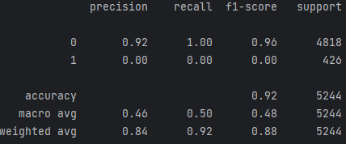
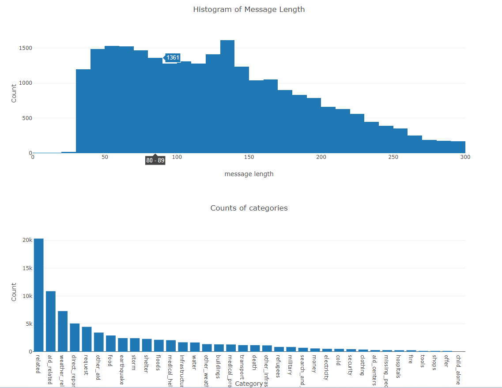

### Table of Contents

1. [Summary](#summary)
2. [Installation](#installation)
2. [How to run](#howtorun)
3. [File Descriptions](#files)
5. [Licensing, Authors, and Acknowledgements](#licensing)

## Summary 
This project is a part of Udacity Nano degree of Data Scientist, and it covers the part 4 of the course, Data Engineering

It starts with building a ETL pipeline then move to a ML pipeline to train a classification model by using the final data

from the ETL process.

Plus you can check some visual examples of the data by running the app.

## Installation 

You need to install such libraries: pandas, scikit-learn, plotly, flask, sqlalchemy and nltk

## How to run 

1. To run the ETL pipeline, you can run process_data.py python script by passing some arguments for file paths
2. After that, you can run train_classifier.py script to build your own model and save it as a pickle file.
3. Also, you can launch an app by running the run.py script in app directory to see some example visualization of the data if you complete the ETL process.

## File Descriptions 
There are two main python script files in this project.
1. data/process_data.py handles ETL pipeline and save the final data in the same directory.
2. models.train_classifier builds a classification model and save it in the same directory.

## Future work
1. The data is imbalanced, and we could tackle this by using resampling technique.

## Screen captures
1. This is an example of a model prediction result for **medical_help** category. You can find more results of other categories in ML pipeline notebook.

2. I added two more visualizations. One is a histogram of message length and the counts of each category

## Licensing, Authors, Acknowledgements

Author: Injae Lee

Thank Udacity for this great course work.

I recommend other students only use my code as a reference for running rather than just copying and pasting them.
